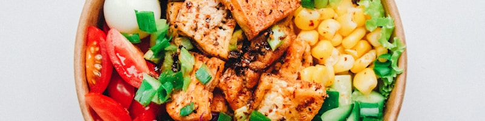

# Know Your Needs - Nutrition Estimator 🥦

A simple Flask-based web application that calculates your **ideal weight**, **BMI**, and **daily nutrition needs** (Protein, Vitamins, and Minerals) based on your **height**, **weight**, and **activity level**.

> 📱 Optimized for Android & Windows devices

---

## 🔧 Features

- Calculates **Ideal Weight** using Broca’s formula
- Calculates **BMI** and gives category (Underweight, Normal, Overweight, Obese)
- Estimates **daily protein requirement**
- Shows recommended intake for:
  - Vitamin B12
  - Vitamin D
  - Vitamin E
  - Iron, Zinc, Calcium
- Activity-based suggestions
- Health advice if BMI is not within the normal range
- Mobile-friendly design with banner and icons

---

## 📷 Preview



---

## 🚀 How to Run Locally

### 1. Clone the Repository
```bash
git clone https://github.com/<your-username>/know-your-needs.git
cd know-your-needs
